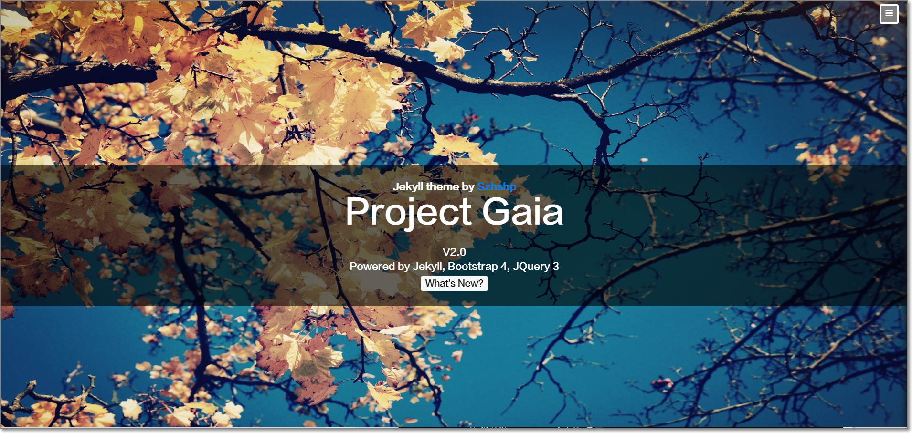
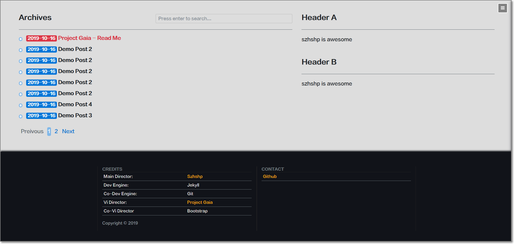
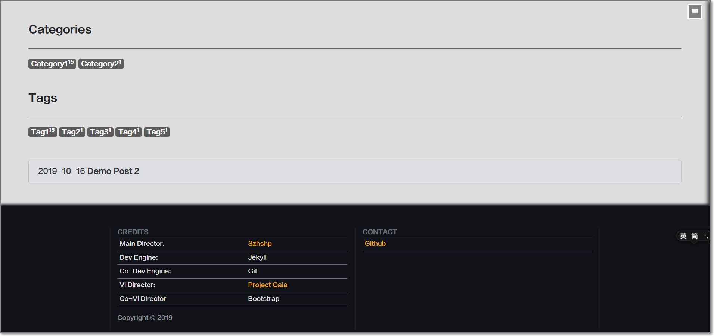
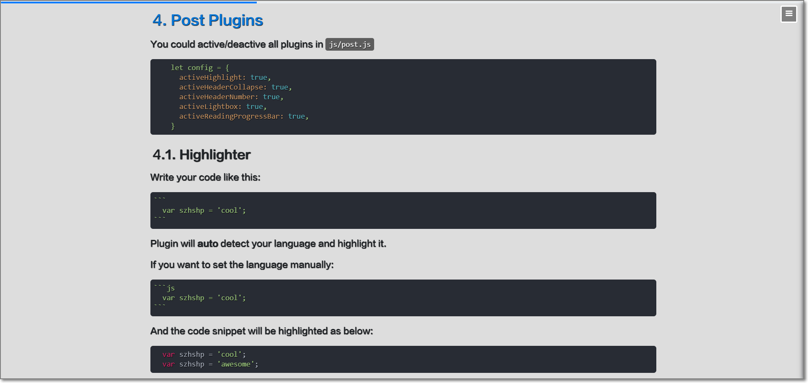

>
>## News (2020 July)
>
>**No more maintenance for this repo.** I have something new for you -->> [Project Titan](https://github.com/szhielelp/NextJS-BlogTemplate-ProjectTitan) <<--
>
>**Project Titan** is built with **NextJS** x **Material UI** x **Typescript**, with totally same styles as **Project Gaia**.
>
>You can migrate to **Project Titan** from **Project Gaia** seamlessly.
>
>Check below two sites then you can see the differences:
>
>- Project Titan: [https://szhshp.org](https://szhshp.org)
>- Project Gaia: [https://legacy.szhshp.org](https://legacy.szhshp.org)

<h1 align="center">
  <a href="https://github.com/szhielelp/JekyllTheme-ProjectGaia">
    Project Gaia
  </a>
</h1>


## Demo 







## Usage

1. Fork and give me a star!
1. `Important`: Please change the `baseurl` value in  `_config.yml` to [your repo name]


## Whats New in Version 2.0?

1. New sidebar design 
1. New category page design
1. New code highlighter
1. Animations
2. SCSS + ES6

## Blog Plugins

### Stickie Post

Put a attribute `stickie: true` in YAML header for specific post:

```js
layout: post
title: blablablalala
category : Comic
tags : [Comic, 10101]
stickie: true 
```

Then current post will show ahead of other posts.


### Comments Plugin

Change the content in `_includes/comment-full.html`, then all post pages will have a comment plugin.

## Post Plugins

You could active/deactive all plugins in `js/post.js`

```javascript
    let config = {
      activeHighlight: true,
      activeHeaderCollapse: true,
      activeHeaderNumber: true,
      activeLightbox: true,
      activeReadingProgressBar: true,
    }
```


### Highlighter


Write your code like this:

    ```
      var szhshp = 'cool';
    ```

Plugin will **auto** detect your language and highlight it.

If you want to set the language manually:


    ```js
      var szhshp = 'cool';
    ```


And the code snippet will be highlighted as below:


```js
  var szhshp = 'cool';
  var szhshp = 'awesome';
```


### headerNumber

Add episode numbers for main headers


### md-post-header-collapse

Realized with this repo: [    szhielelp/md-post-header-collapse  ](https://github.com/szhielelp/md-post-header-collapse)

Run `$.headerCollapseRobot()` after post loaded.

```js
    $.headerCollapseRobot('#page-content', ['h1', 'h2', 'h3'], ['blockquote']);
```


You can try clicking on the icons near titles.


### Reading Progressbar

Inspired from [http://es6.ruanyifeng.com/#docs/promise](http://es6.ruanyifeng.com/#docs/promise)


It will show your reading progress for current post.


### Picture Lightbox 

A plugin for better experience of displaying pictures.


Example Usage:

```
  


  
  *Here is desc*
```

## Trouble Shooting

I'm trying to keep this project as simple as possible, but if you still get stuck into any problem, please raise a issue in [Github](https://github.com/szhielelp/JekyllTheme-ProjectGaia). I may check it if I got time.


## License

MIT

## Donate

[   Donate via Alipay    ](http://szhshp.org/about.html)

## Change Log

[    Change Log   ](https://github.com/szhielelp/JekyllTheme-ProjectGaia#change-log)
