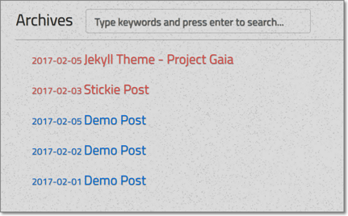

<h1 align="center">
  <a href="https://docsify.js.org">
    Project Gaia
  </a>
</h1>

<p align="center">
  个人无聊的时候乱写的Jekyll主题, 通过Bootstrap 4 + JQuery 3实现
</p>


## 实例 


## 用法

1. [   给我捐款   ](http://szhshp.org/about.html)
1. [   给我捐款   ](http://szhshp.org/about.html)
1. [   给我捐款   ](http://szhshp.org/about.html)
1. Fork 然后 give me a star!
1. `Important` 记得把 `_config.yml` 文件中的 `baseurl` 改成实际使用的URL

## 插件

### 文章置顶

Post的header里面加个参数`stickie: true`即可

header示例:

```
layout: post
title: blablablalala
category : Comic
tags : [Comic, 10101]
stickie: true
```

然后这篇文章就会出现在所有文章的前面



### 三方评论框

建议使用纯JS的三方评论，这样不会改变文章页面的总体结构

给所有文章页面添加三方评论插件，只需要修改`_includes/comment-full.html`里面的内容。


## 文章插件

你可以在 `js/post.js`开启或关闭某些插件

```javascript
  var config = {
    headerCollapsibleActive: true,
    syntaxHighlighter: true,
    toc: true,
    headerNumber: true,
    readingProgressBar: true,
    lightbox: true
  }
```

### 代码高亮

通过这玩意实现的 : [    syntaxhighlighter/syntaxhighlighter](https://github.com/syntaxhighlighter/syntaxhighlighter)

首先你要将对应语法的brush文件引入 `post.html`，模板中已经包含了很多语言:

```html
<!-- Highlighter  -->
   <script src="{{site.url}}{{site.baseurl}}/js/shCore.js" type='text/javascript'></script>
   <!-- <script src="{{site.url}}{{site.baseurl}}/js/shBrushCSharp.js" type='text/javascript'></script> -->
   <script src="{{site.url}}{{site.baseurl}}/js/shBrushColdFusion.js" type='text/javascript'></script>
   <script src="{{site.url}}{{site.baseurl}}/js/shBrushCpp.js" type='text/javascript'></script>
   <script src="{{site.url}}{{site.baseurl}}/js/shBrushCss.js" type='text/javascript'></script>
   <script src="{{site.url}}{{site.baseurl}}/js/shBrushJava.js" type='text/javascript'></script>
   <script src="{{site.url}}{{site.baseurl}}/js/shBrushPhp.js" type='text/javascript'></script>
   <script src="{{site.url}}{{site.baseurl}}/js/shBrushRuby.js" type='text/javascript'></script>
   <script src="{{site.url}}{{site.baseurl}}/js/shBrushSql.js" type='text/javascript'></script>
   <script src="{{site.url}}{{site.baseurl}}/js/shBrushXml.js" type='text/javascript'></script>
   <script src="{{site.url}}{{site.baseurl}}/js/shBrushJScript.js" type='text/javascript'></script>
```


在普通的多行代码前后加一个`<pre>`并且类名里面写上对应的语言

```html
<pre class="brush: js">
  var szhshp = 'cool';
</pre>
```

`<pre>`的类名必须满足如下格式：

```
brush: [language]
```

高亮示例：


### TOC目录

通过这玩意实现的: [    jgallen23/toc  ](https://github.com/jgallen23/toc)


同样`Jquery.ready`时自动运行

### 段落标题

给文章的歌标题前添加段落编号

>总觉得header前面加个数字看起来会整齐一些

### md-post-header-collapse

通过这玩意实现的: [    szhielelp/md-post-header-collapse  ](https://github.com/szhielelp/md-post-header-collapse)

Post加载完毕后运行`$.headerCollapseRobot()`

```javascript
/*header collapsible*/
$.headerCollapseRobot(
  arr_Id_CollapseEnds =  new Array("end"),                       
  arr_Collapsible_Tag = new Array("H1","H2","H3"),                       
  arr_ExcludeElemPrefix_InCollapsible  = new Array("comment-"),      
  arr_ExcludeElemPrefix_InCollapsing = new Array("sidebar-toc-Ik4D-")
)
```


点击标题旁边的加减号即可将章节段落进行收缩/展开


### 阅读进度条

灵感来自于 [http://es6.ruanyifeng.com/#docs/promise](http://es6.ruanyifeng.com/#docs/promise)


某日我心情很好于是就做了这个东西


### Lightbox

一个方便图片展示的插件


## Trouble Shooting

I'm trying to keep this project as simple as possible, but if you still get stuck into any problem, please leave a msg here: [Demo page ]( https://szhielelp.github.io/JekyllTheme-ProjectGaia/). I may check it if I got time.


## 遇到问题

你可以在[项目页面 ]( https://szhielelp.github.io/JekyllTheme-ProjectGaia/) 或者 [我的博客 ](http://szhshp.org ) 留言，我一般会回复并且提供一些解决方案

## 开源协议

MIT

## 捐款

[  支付宝    ](http://szhshp.org/about.html)

## 更新历史

[ 更新历史   ](https://github.com/szhielelp/JekyllTheme-ProjectGaia#readme)